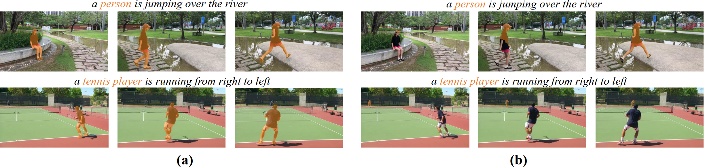

# SOC: Semantic-Assisted Object Cluster for Referring Video Object Segmentation

[Zhuoyan Luo*](https://robertluo1.github.io/), [Yicheng Xiao*](https://easonxiao-888.github.io/), [Yong Liu*](https://workforai.github.io/), Shuyan Li, Yitong Wang, Yansong Tang, Xiu Li, Yujiu Yang

[Tsinghua University Intelligent Interaction Group](https://sites.google.com/view/iigroup-thu/home)

<a href='https://arxiv.org/abs/2305.17011'></a>

**Updates:**

- **Oct. 29, 2023**: Code is released now.
- **Sep. 22, 2023**: Our paper is accepted by NeurIPS 2023!

## Abstract
This paper studies referring video object segmentation (RVOS) by boosting videolevel visual-linguistic alignment. Recent approaches model the RVOS task as
a sequence prediction problem and perform multi-modal interaction as well as
segmentation for each frame separately. However, the lack of a global view of
video content leads to difficulties in effectively utilizing inter-frame relationships and understanding textual descriptions of object temporal variations. To address this issue, we propose Semantic-assisted Object Cluster (SOC), which aggregates video content and textual guidance for unified temporal modeling and cross-modal alignment. By associating a group of frame-level object embeddings with language tokens, SOC facilitates joint space learning across modalities and time steps. Moreover, we present multi-modal contrastive supervision to help construct wellaligned joint space at the video level. We conduct extensive experiments on popular RVOS benchmarks, and our method outperforms state-of-the-art competitors on all benchmarks by a remarkable margin. Besides, the emphasis on temporal coherence
enhances the segmentation stability and adaptability of our method in processing
text expressions with temporal variations.

## Framework


## Visualization Result


## Text expressions with temporal variations
(a) and (b) are segmentation results of our SOC and ReferFormer. For more details, please refer to <a href="https://arxiv.org/pdf/2305.17011.pdf">paper</a>



## Environment Setup
 - install pytorch `pip install torch==1.11.0+cu113 torchvision==0.12.0+cu113 torchaudio==0.11.0 --extra-index-url https://download.pytorch.org/whl/cu113`
 - install other dependencies
  `pip install h5py opencv-python protobuf av einops ruamel.yaml timm joblib pandas matplotlib cython scipy` 
 - install transformers numpy
 `pip install transformers==4.24.0`
 `pip install numpy==1.23.5`
 - install pycocotools
 `pip install -U 'git+https://github.com/cocodataset/cocoapi.git#subdirectory=PythonAPI'`
 - build up MultiScaleDeformableAttention
    ```
    cd ./models/ops
    python setup.py build install
    ``` 

## Data Preparation
The Overall data preparation is set as followed.
We put rvosdata under the path /mnt/data_16TB/lzy23/rvosdata and please change it to xxx/rvosdata according to your own path.

```text
rvosdata
└── a2d_sentences/ 
    ├── Release/
    │   ├── videoset.csv  (videos metadata file)
    │   └── CLIPS320/
    │       └── *.mp4     (video files)
    └── text_annotations/
        ├── a2d_annotation.txt  (actual text annotations)
        ├── a2d_missed_videos.txt
        └── a2d_annotation_with_instances/ 
            └── */ (video folders)
                └── *.h5 (annotations files)
└── refer_youtube_vos/ 
    ├── train/
    │   ├── JPEGImages/
    │   │   └── */ (video folders)
    │   │       └── *.jpg (frame image files) 
    │   └── Annotations/
    │       └── */ (video folders)
    │           └── *.png (mask annotation files) 
    ├── valid/
    │   └── JPEGImages/
    │       └── */ (video folders)
    |           └── *.jpg (frame image files) 
    └── meta_expressions/
        ├── train/
        │   └── meta_expressions.json  (text annotations)
        └── valid/
            └── meta_expressions.json  (text annotations)
└── coco/
      ├── train2014/
      ├── refcoco/
        ├── instances_refcoco_train.json
        ├── instances_refcoco_val.json
      ├── refcoco+/
        ├── instances_refcoco+_train.json
        ├── instances_refcoco+_val.json
      ├── refcocog/
        ├── instances_refcocog_train.json
        ├── instances_refcocog_val.json
```

## Pretrained Model
We create a folder for storing all pretrained model and put them in the path
/mnt/data_16TB/lzy23/pretrained, please change to xxx/pretrained according to your own path.
```
pretrained
└── pretrained_swin_transformer
└── pretrained_roberta
```
- For pretrained_swin_transformer folder
download [Video-Swin-Base](https://github.com/SwinTransformer/storage/releases/download/v1.0.4/swin_base_patch244_window877_kinetics400_22k.pth)
- For pretrained_roberta folder
download config.json pytorch_model.bin tokenizer.json vocab.json from huggingface (roberta-base)

## Model Zoo
The checkpoints are as follows:
|Setting  | Backbone   | Checkpoint |
|---------|------------| ---------- |
|a2d_from_scratch | Video-Swin-T | [Model](https://drive.google.com/file/d/1ILmfHRRcOZ1CWo2l4fATF9SYYnc8ryTP/view?usp=sharing) |
|a2d_with_pretrain | Video-Swin-T | [Model](https://drive.google.com/file/d/1sJ40p6ql2k2JLYkUltPst-_51GdvGgC4/view?usp=sharing) |
|a2d_with_pretrain | Video-Swin-B | [Model](https://drive.google.com/file/d/10937_A8QUkTpD-fUjHg8_qN9HWMCXRG3/view?usp=sharing) |
ytb_from_scratch | Video-Swin-T | [Model](https://drive.google.com/file/d/179Xv5t1pGTbloMnjf7OurRYo7TlfpmYy/view?usp=sharing) |
ytb_with_pretrain | Video-Swin-T | [Model](https://drive.google.com/file/d/1YzeUonrccqyglYvMK04lrbJBDStS51lV/view?usp=sharing) |
ytb_with_pretrain | Video-Swin-B | [Model](https://drive.google.com/file/d/1DX47RbXKI1_INIgyxh3ZuAiRMq7rMkql/view?usp=sharing) |
ytb_joint_train | Video-Swin-T | [Model](https://drive.google.com/file/d/15mHrg2mry01PllEyZql9arAa6-zYHfGu/view?usp=sharing) |
ytb_joint_train | Video-Swin-B | [Model](https://drive.google.com/file/d/1SaDLcQOn_a1L-Bw8LGB2CiQIGkZAO3Wu/view?usp=sharing) |


## Output Dir
We put all outputs under a dir. Specifically, We set /mnt/data_16TB/lzy23/SOC as the output dir, so please change it to xxx/SOC.

## Training

### From scratch
We only use Video-Swin-T as backbone to train and eval the dataset.
- A2D
  Run the scripts "./scripts/train_a2d.sh" and **make sure that change the path "/mnt/data_16TB/lzy23" to your own path(same as the following)**.
  ```text
  bash ./scripts/train_a2d.sh
  ```
  The key parameters are as follows and change the ./configs/a2d_sentences.yaml:
  | lr | backbone_lr | bs | GPU_num | Epoch | lr_drop |
  |:----:|:-------------:|:----:|:---------:|:-------:|:-------:|
  |5e-4| 5e-5        | 2  |  2      |  40   | 15(0.2) |

- Ref-Youtube-VOS 
  Run the "./scripts/train_ytb.sh.
  ```text
  bash ./scripts/train_ytb.sh
  ```

  The main parameters are as follow:
  | lr |backbone_lr| bs | num_class | GPU_num | freeze_text_encoder| lr_drop| Epoch |
  |:----:|:----------:|:----:|:-----------:|:---------:|:--------:|:--------:|:------:|
  |1e-4| 1e-5     | 1  |  65       |   8     |     true           |  20(0.1)|  30   |

  Please change the ./configs/refer_youtube_vos.yaml according to the setting

  Change the dataset_path according to your own path in ./datasets/refer_youtube_vos/refer_youtube_vos_dataset.py


### With Pretrain
We perform pretrain and finetune on A2d-Sentences and Ref-Youtube-VOS dataset using Video-Swin-Tiny and Video-Swin-Base. Following previous work, we first pretrain on RefCOCO dataset and then finetune.

- Pretrain

  The followings are the key parameters for pretrain. When pretrain, please specify the corresponding backbone. (Video-Swin-T and Video-Swin-B)

  | lr |backbone_lr|text_encoder_lr | bs | num_class | GPU_num | freeze_text_encoder| lr_drop| Epoch |
    |:----:|:----------:|:------:|:----:|:-----------:|:---------:|:--------:|:--------:|:------:|
    |1e-4| 1e-5  | 5e-6  | 8  |  1       |   8     |     False          |  15 20(0.1)|  30   |

- Ref-Youtube-VOS

  We finetune the pretrained weight using the following key parameters:
  | lr |backbone_lr|text_encoder_lr | bs | num_class | GPU_num | freeze_text_encoder| lr_drop| Epoch |
    |:----:|:----------:|:------:|:----:|:-----------:|:---------:|:--------:|:--------:|:------:|
    |1e-4| 1e-5  | 5e-6 | 8  |  1       |   8     |     False         |  10(0.1)|  25   |

- A2D-Sentences

  We finetune the pretrained weight on A2D-Sentences using the following key parameters:
  | lr |backbone_lr|text_encoder_lr | bs | num_class | GPU_num | freeze_text_encoder| lr_drop| Epoch |
    |:----:|:----------:|:------:|:----:|:-----------:|:---------:|:--------:|:--------:|:------:|
    |3e-5| 3e-6  | 1e-6 | 1  |  1       |   8     |     true         |  - |  20   |

### Joint training
We only perform Joint training on Ref-Youtube-VOS dataset with Video-Swin-Tiny and Video-Swin-Base.

- Ref-Youtube-VOS

  Run the scripts ./scripts/train_joint.sh. Remember to change the path 
  and the backbone name before running.

  The main parameters (Tiny and Base) are as follow:
    | lr |backbone_lr| bs| num_class | GPU_num | freeze_text_encoder| lr_drop | Epoch|
    |:----:|:----------:|:----:|:-----------:|:---------:|:--------------------:|:--------:| -----|
    |1e-4| 1e-5     | 1  |  1        |   8     |     true           |  20(0.1)|  30  |


## Evaluation

- A2D-Sentences
  Run the scripts ./scripts/eval_a2d.sh and remember to specify the checkpoint_path in the config file.

- JHMDB-Sentences 
  Please refer to [Link](https://github.com/mttr2021/MTTR) to prepare for the datasets and specify the checkpoint path in yaml file. **Following the previous setting, we directly use the checkpoint trained on A2d-Sentences to test.**

- Ref-Youtube-VOS
  ```text
  bash ./scripts/infer_ref_ytb.sh
  ```
  Remember to specify the checkpoint_path and the video backbone name.

- Ref-DAVIS2017
  Please refer to [Link](https://github.com/wjn922/ReferFormer) to prepare for the DAVIS dataset. We provide the infer_davis.sh to evaluate.
  Remember to specify the checkpoint_path and the video backbone name.

## Inference
We provide the interface for inference
```text
bash ./scripts/demo_video.sh
```

## Acknowledgement
Code in this repository is built upon several public repositories. Thanks for the wonderful work [Referformer](https://github.com/wjn922/ReferFormer) and [MTTR](https://github.com/mttr2021/MTTR)

## Citations
If you find this work useful for your research, please cite:
```
@article{SOC,
  author       = {Zhuoyan Luo and
                  Yicheng Xiao and
                  Yong Liu and
                  Shuyan Li and
                  Yitong Wang and
                  Yansong Tang and
                  Xiu Li and
                  Yujiu Yang},
  title        = {{SOC:} Semantic-Assisted Object Cluster for Referring Video Object
                  Segmentation},
  journal      = {CoRR},
  volume       = {abs/2305.17011},
  year         = {2023},
}
```


